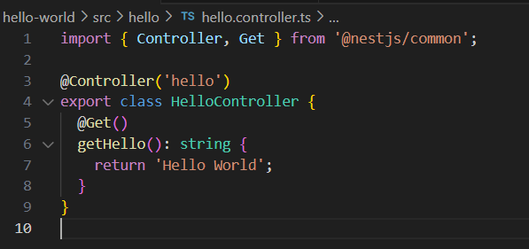

# Nestjs_Hello_world_app

**Deploy Nestjs - Hello World Application to the AWS EC2**

**Step1: Launch an EC2 instance:**

1. **Go to aws console and launch an EC2 instance.**

   

   

   **Fill all details and click on Launch Instance.** 

   **Connect to your EC2 instance using SSH by running the below command**

   `	`***ssh -i “pvt-key.pem” ec2\_user@ip-address***

1. **Install required Dependencies to run the Nestjs application**

   `	`**Run the below commands** 

1. **sudo apt update -y**
1. **sudo apt install nodejs npm**

   

**Now after successfully installing the nodejs and npm package,** 

**We have to create the hello world application by running the below command:**

1. **npm install -g @nestjs/cli**
1. **nest new hello-world**

   **It will create a directory structure given below**

   

**After this we have to create controller by running the below command**

1. ***nest generate controller hello***

***It will create hello controller now add the code here and update the hello.controller.ts***

***Also update app.module.ts with the below***

***Once the application is ready we have to run it by running the below command***

1. ***npm install***
1. ***npm run start***

***Now we have to access this application on port no 3000 for that we have to modify our aws security group***

1. ***Go to aws instance and click on security*** 

***We well redirect to security group then we have to edit the inbound rule and allow port no 3000***

***Now we can run the application on http://13.40.71.205:3000***

